# Retail Disruption Management Agent — Workflow Plan

Design for a GenAI workflow built in a visual node-based builder.
Time budget: 15 minutes to type. Copy-paste the prompts verbatim.

---

## 1. Problem recap

RetailCo receives disruption alerts and must:
- Selectively call relevant APIs (penalty for calling all)
- Use confidence-based branching
- Dynamically score severity from initial + retrieved signals
- Check resources before escalating
- Emit a structured rationale

**7 APIs**: Demand Signal, Inventory, Alternative Availability, Regional Importance, Disruption History, Supply Chain Status, Resource Availability.

**13 node types**: Input, Llm Step, Knowledge Retrieval, Classifier Router, Condition Branch, Loop, Human Handoff, Output Formatter, Evaluator Guardrail, Custom Code, Prompt Template, Retry Fallback, Merge Join.

---

## 2. AI-harness design principles applied

| Principle | Where it lives in the workflow |
|---|---|
| Human-in-the-loop | `Human Handoff` only as **fallback** — after exhausted auto-revisions, on REJECT verdict, or for structural confidence failures |
| Adversarial self-review + self-revision | `Evaluator Guardrail` at each enrichment iteration, after scoring, and after the final recommendation. Emits APPROVE / **ITERATE with actionable suggestions** / REJECT. ITERATE loops back to the upstream node with suggestions appended — bounded by hard retry caps (1 on score, 2 on recommendation) |
| Confidence gating | `Classifier Router` + loop break + pre-escalation `Condition Branch` |
| Fail-safe tool use | `Retry Fallback` wrapping every `Knowledge Retrieval` |
| Structured I/O | `Prompt Template` + `Output Formatter` with strict JSON |
| Explainability-by-construction | Every node appends to a running `trace` — see §4.0 Block A schema |
| Selective tool use | Router picks lane; loop breaks early on confidence ≥ 0.8 |
| Least-privilege escalation | Resource Availability API is only called when severity ≥ HIGH |

---

## 3. Workflow diagram

### 3a. Mermaid flowchart

```mermaid
%%{init: {
  "theme": "base",
  "flowchart": {
    "curve": "basis",
    "nodeSpacing": 55,
    "rankSpacing": 75,
    "padding": 12,
    "useMaxWidth": true,
    "htmlLabels": true
  },
  "themeVariables": {
    "fontFamily": "Inter, Segoe UI, sans-serif",
    "fontSize": "14px",
    "primaryColor": "#ffffff",
    "lineColor": "#64748b"
  }
}}%%
flowchart TD
    %% ─────────── Intake ───────────
    Input([" <b>1 · Input</b><br/><span style='font-size:11px'>alert + structured signals</span> "])
    Triage[" <b>2 · LLM Triage</b><br/><span style='font-size:11px'>extract signals · confidence<br/>initial severity · no APIs</span> "]
    Sanity{{" <b>2.check · Custom Code</b><br/><span style='font-size:11px'>schema + coherence<br/>deterministic</span> "}}
    Router{" <b>3 · Classifier Router</b><br/><span style='font-size:11px'>HIGH · LOW · AMBIG</span> "}

    %% ─────────── Lane A · Fast-confirm ───────────
    subgraph LANE_A [" &nbsp;LANE · HIGH &nbsp;—&nbsp; fast confirmation &nbsp;"]
      direction TB
      FastA1[" <b>4A.1 · KR</b><br/>Inventory<br/><span style='font-size:11px'>retry-fallback</span> "]
      FastA2[" <b>4A.2 · KR</b><br/>Demand Signal<br/><span style='font-size:11px'>retry-fallback</span> "]
      FastACheck{" <b>4A.check</b><br/><span style='font-size:11px'>stockout confirmed<br/>OR demand = surge?</span> "}
      FastA1 --> FastA2 --> FastACheck
    end

    %% ─────────── Lane B · Early exit ───────────
    EarlyExit[/" <b>4B · Early Exit</b><br/><span style='font-size:11px'>0 APIs · monitor</span> "/]

    %% ─────────── Lane C · Enrichment loop ───────────
    subgraph LANE_C [" &nbsp;LANE · AMBIG &nbsp;—&nbsp; sequential enrichment loop &nbsp;"]
      direction TB
      LoopSelect[" <b>5.select · LLM</b><br/><span style='font-size:11px'>choose next API<br/>skip apis_called</span> "]
      LoopKR[" <b>5.kr · KR</b><br/><span style='font-size:11px'>dynamic API<br/>retry-fallback</span> "]
      LoopEval{{" <b>5.eval · Guardrail</b><br/><span style='font-size:11px'>adversary · conf ≥ 0.8 → break<br/>else propose next</span> "}}
      LoopSelect --> LoopKR --> LoopEval
      LoopEval -->|continue| LoopSelect
    end

    Merge((" <b>6</b><br/>Merge "))

    %% ─────────── Scoring ───────────
    subgraph SCORE_BLK [" &nbsp;Severity scoring &nbsp;—&nbsp; self-revision (max 1) &nbsp;"]
      direction TB
      Score[" <b>7 · LLM Risk Score</b><br/><span style='font-size:11px'>base + amplifiers<br/>contributing_signals</span> "]
      ScoreEval{{" <b>7.eval · Guardrail</b><br/><span style='font-size:11px'>audit scoring math</span> "}}
      ScoreRouter{" <b>7.5 · Router</b><br/><span style='font-size:11px'>APPROVE · ITERATE · REJECT</span> "}
      Score --> ScoreEval --> ScoreRouter
      ScoreRouter -->|ITERATE · retry &lt; 1| Score
    end

    SevGate{" <b>8 · Condition</b><br/><span style='font-size:11px'>severity ≥ HIGH ?</span> "}
    ResKR[" <b>9 · KR</b><br/>Resource Availability<br/><span style='font-size:11px'>retry-fallback</span> "]

    %% ─────────── Recommendation ───────────
    subgraph REC_BLK [" &nbsp;Recommendation &nbsp;—&nbsp; adversarial self-revision (max 2) &nbsp;"]
      direction TB
      Rec[" <b>10 · LLM Recommendation</b><br/><span style='font-size:11px'>escalate · redistribute<br/>substitute · monitor</span> "]
      FinalEval{{" <b>11 · Guardrail</b><br/><span style='font-size:11px'>APPROVE · ITERATE+suggestions<br/>REJECT</span> "}}
      FinalRouter{" <b>11.5 · Router</b><br/><span style='font-size:11px'>adversary outcome</span> "}
      Rec --> FinalEval --> FinalRouter
      FinalRouter -->|ITERATE · retry &lt; 2| Rec
    end

    Handoff[/" <b>H · Human Handoff</b><br/><span style='font-size:11px'>fallback only</span> "/]
    Output([" <b>12 · Output Formatter</b><br/><span style='font-size:11px'>deterministic rationale<br/>from contributing_signals</span> "])

    %% ─────────── Main flow ───────────
    Input --> Triage --> Sanity
    Sanity -->|pass| Router
    Sanity -->|fail · retry 1×| Triage
    Sanity -->|fail after retry| Handoff

    Router -->|LANE_HIGH| FastA1
    Router -->|LANE_LOW| EarlyExit
    Router -->|LANE_AMBIG| LoopSelect

    EarlyExit --> Output

    FastACheck -->|confirmed| Score
    FastACheck -->|disconfirmed · demote| LoopSelect

    LoopEval -->|break · confident| Merge
    Merge --> Score

    ScoreRouter -->|APPROVE| SevGate
    ScoreRouter -->|REJECT / exhausted| Handoff

    SevGate -->|yes · HIGH / CRIT| ResKR --> Rec
    SevGate -->|no · LOW / MED| Rec

    FinalRouter -->|APPROVE| Output
    FinalRouter -->|REJECT / human / exhausted| Handoff

    Handoff --> Output

    %% ─────────── Palette ───────────
    classDef llm    fill:#e0ecff,stroke:#2563eb,stroke-width:1.5px,color:#0f172a
    classDef guard  fill:#fff4cc,stroke:#d97706,stroke-width:1.5px,color:#0f172a
    classDef det    fill:#d9f7e1,stroke:#16a34a,stroke-width:1.5px,color:#0f172a
    classDef route  fill:#fde1ef,stroke:#db2777,stroke-width:1.5px,color:#0f172a
    classDef api    fill:#e4e8ff,stroke:#4338ca,stroke-width:1.5px,color:#0f172a
    classDef human  fill:#ffe2e2,stroke:#dc2626,stroke-width:1.5px,color:#0f172a
    classDef io     fill:#f1f5f9,stroke:#334155,stroke-width:1.5px,color:#0f172a
    classDef merge  fill:#f5f3ff,stroke:#7c3aed,stroke-width:1.5px,color:#0f172a

    class Triage,Score,Rec,LoopSelect llm
    class LoopEval,ScoreEval,FinalEval guard
    class Sanity det
    class Router,FastACheck,ScoreRouter,SevGate,FinalRouter route
    class FastA1,FastA2,LoopKR,ResKR api
    class Handoff human
    class Input,Output,EarlyExit io
    class Merge merge

    %% ─────────── Subgraph framing ───────────
    style LANE_A    fill:#f8fbff,stroke:#94a3b8,stroke-dasharray:4 4,color:#475569
    style LANE_C    fill:#fbfaff,stroke:#94a3b8,stroke-dasharray:4 4,color:#475569
    style SCORE_BLK fill:#fffcf2,stroke:#94a3b8,stroke-dasharray:4 4,color:#475569
    style REC_BLK   fill:#fff8fb,stroke:#94a3b8,stroke-dasharray:4 4,color:#475569

    linkStyle default stroke:#64748b,stroke-width:1.4px
```



### 3b. Legend

| Colour | Node role |
|---|---|
| 🟦 Blue | LLM reasoning step (Llm Step) |
| 🟨 Amber | Evaluator Guardrail (adversarial review) |
| 🟩 Green | Deterministic Custom Code (no LLM, cheap & reliable) |
| 🟪 Pink | Classifier Router / Condition Branch (control flow) |
| 🟦 Indigo | Knowledge Retrieval (API call, Retry-Fallback wrapped) |
| 🟥 Red | Human Handoff (fallback only — never the default) |

### 3c. Reasoning notes on the diagram

1. **Three lanes off the Router** enforce *selective API usage*. LOW calls zero APIs. HIGH calls two confirmatory APIs. AMBIG enters the sequential enrichment loop. The lane split itself satisfies success criterion 1.
2. **[4A.check] demotion edge** is the recovery path for a wrong initial CRIT hypothesis. Without it, the fast-confirm lane would rubber-stamp bad triage. The demotion back into [5] means we re-derive severity from real signals instead of acting on the guess.
3. **The Loop's break edge goes to Merge Join, not directly to Score.** This keeps aggregation explicit — Merge Join is the single point where the enrichment trace becomes the input context for [7]. Scoring reads one bundle, not a streamed history.
4. **[7.eval] + [7.5] Router** give the severity score its own self-revision loop — a single retry. Severity is the most-cascading decision in the flow (it gates both the resource check and the action), so auditing it cheaply before committing avoids large downstream corrections.
5. **[11] + [11.5] ITERATE edge loops back to [10], not further upstream.** Deliberate scoping: the adversary on the recommendation can only demand a different *action* given the same signals. If it wants different signals, that's a REJECT and the flow escalates to Human Handoff. Keeps retry loops bounded and local.
6. **Every loopback (Sanity retry, Score ITERATE, Rec ITERATE) has an integer retry counter and a hard cap.** No uncapped self-correction.
7. **Four guardrails at four different stakes**: free deterministic check at [2.check], cheap LLM break decision in the loop, mid-cost LLM score audit, full LLM recommendation adversary. Guardrails are *proportional to the cost of being wrong* at each stage.

---

## 4. Node-by-node config and prompts

Each node block below uses builder-ready fields. Copy the values straight into the corresponding form.

**Field conventions by node type**

| Node type | Fields to fill in the builder |
|---|---|
| Llm Step | System prompt · User prompt template · Output classes (comma-separated JSON keys or labels) · Notes |
| Evaluator Guardrail | System prompt · User prompt template · Output classes · Notes (uses same shape as Llm Step) |
| Classifier Router | Classification prompt · Output classes (comma-separated labels) · Notes |
| Condition Branch | Classification prompt (boolean/expression) · Output classes · Notes |
| Knowledge Retrieval | Datasource (which API) · Notes |
| Custom Code | Pseudocode · Output classes · Notes |
| Prompt Template / Output Formatter | Template string · Schema · Notes |
| Loop | Body (sequence of inner nodes) · Max iterations · Break condition · Notes |
| Merge Join / Input / Retry Fallback / Human Handoff | Wiring-only — see node block |

---

### [4.0] State-writer contracts

**Block A — `trace[]` entry writers (append-only)**

Schema:
```
trace[i] = {
  type: "triage" | "api_call" | "eval" | "score" | "rec",
  step: "<node_id>",
  api: "<name|null>",
  why: "<1-line|null>",
  result_summary: "<1-line|null>",
  delta_to_severity: "+1" | "0" | "-1" | null,
  pass_index: <int|null>,
  error: true|false   (api_call only; omitted elsewhere)
}
```

Writers:
- `type=triage` — [2] only. `step="[2]"`, `why=<reasoning>`, others null.
- `type=api_call` — Retry-Fallback wrapper around every KR ([4A.1], [4A.2], [5.kr], [9]). Fields: `step`, `api`, `why`, `result_summary`, `error`. On `error=true`, entry still appended.
- `type=eval` — every Guardrail ([5.eval], [7.eval], [11]). Fields: `step`, `why=verdict`, `result_summary=counterexample_or_issues_join`, `pass_index=retry_count_before`.
- `type=score` — [7] only. `step="[7]"`, `pass_index` (from `$.score_retry` at entry), `delta_to_severity=null`, `result_summary=score_reasoning`.
- `type=rec` — [10] only. `step="[10]"`, `pass_index` (from `$.rec_retry` at entry), `result_summary=action`.

**Block B — State-variable writers (non-trace)**

| Name | Writer node | Semantics | Initial |
|---|---|---|---|
| `score_revision_notes` | [7.5] on ITERATE | overwrite | `""` |
| `revision_notes` | [11.5] on ITERATE | overwrite | `""` |
| `apis_called[]` | Retry-Fallback wrapper on KR success | append-controlled (single-writer) | `[]` |
| `signals.*` | each KR via its Retry-Fallback wrapper (one field per API) | single-write per field | absent |
| `$.score_retry` | [7.5] on ITERATE (increment by 1) | overwrite | `0` |
| `$.rec_retry` | [11.5] on ITERATE (increment by 1) | overwrite | `0` |
| `$.triage_retry` | [2.check] on RETRY_TRIAGE (increment by 1) | overwrite | `0` |
| `pass_index` (on type:score/type:rec trace entries) | [7] and [10] — read `$.score_retry`/`$.rec_retry` at entry, stamp into new trace entry | derived-per-write | n/a |

**`apis_called[]` contract**: single writer = Retry-Fallback wrapper on SUCCESS only. On `error=true`, wrapper appends trace entry but NOT to `apis_called[]`. [12] READS `apis_called[]` — it does NOT rebuild from trace.

---

### [1] Input
- **Type**: Input
- **Fields**: `alert_description` (text), `product_id`, `location_id`, `time_sensitivity` (0–1), `severity_hint` (LOW|MED|HIGH|CRIT)

---

### [2] LLM Triage (signal extraction, NO API calls)
- **Type**: Llm Step
- **System prompt**:
```
You are a retail disruption triage agent. You DO NOT call APIs.
Extract signals from the alert and assign an initial severity with a calibrated confidence on a 0.0–1.0 scale. Return strict JSON only.
```
- **User prompt template**:
```
Disruption alert received:
"""
{{raw_alert_text}}
"""
Additional structured fields provided by the source system:
- Source type: {{source_type}}
- Timestamp: {{timestamp}}

Parse and return the normalised disruption object with exactly these fields:
- product_id, location_id, alert_type
- time_sensitivity (0-1)
- demand_hint: stable | increasing | surge | unknown
- stockout_hint: true | false | unknown
- repeat_hint: true | false | unknown
- strategic_location_hint: true | false | unknown
- initial_severity: LOW | MED | HIGH | CRIT
- confidence: 0.0-1.0
- reasoning: one short line
- trace: [{"type":"triage","step":"[2]","api":null,"why":"<reasoning>","result_summary":null,"delta_to_severity":null,"pass_index":null}]
```
- **Output classes**: `product_id, location_id, alert_type, time_sensitivity, demand_hint, stockout_hint, repeat_hint, strategic_location_hint, initial_severity, confidence, reasoning, trace`
- **Notes**: No API calls here. Confidence scale is 0–1 everywhere in this workflow — do not rename to `score` or `certainty`.

---

### [2.check] Custom Code — Triage Sanity Check
- **Type**: Custom Code (deterministic, no LLM)
- **Pseudocode**:
```
fail_reasons = []
if not triage.product_id or not triage.location_id: fail_reasons.append("missing identifiers")
if not (0 <= triage.time_sensitivity <= 1): fail_reasons.append("invalid time_sensitivity scale")
if triage.initial_severity == "CRIT" and triage.confidence < 0.3: fail_reasons.append("CRIT with near-zero confidence")
if triage.initial_severity == "LOW" and triage.stockout_hint == True: fail_reasons.append("contradictory LOW + stockout")

if fail_reasons and retry_count == 0: route = "RETRY_TRIAGE"
elif fail_reasons:                    route = "HANDOFF"
else:                                 route = "PASS"
```
- **Output classes**: `PASS, RETRY_TRIAGE, HANDOFF`
- **Notes**: Deterministic gate. Cheapest guardrail in the flow — catches garbage triage before it wastes API calls. Retries triage once before escalating to human. Counter: `$.triage_retry` (integer, cap=1, increment site=[2.check], exhaustion destination=Human Handoff, reset=per-alert).

---

### [3] Classifier Router — 3 lanes
- **Type**: Classifier Router
- **Classification prompt**:
```
Classify the disruption into exactly ONE lane based on the triage JSON.

LANE_HIGH  : initial_severity == "CRIT"
             OR (initial_severity == "HIGH" AND time_sensitivity > 0.7 AND stockout_hint == true)
LANE_LOW   : initial_severity == "LOW" AND time_sensitivity < 0.3
             AND demand_hint == "stable" AND repeat_hint == false
LANE_AMBIG : everything else

Return only the label. No prose.
```
- **Output classes**: `LANE_HIGH, LANE_LOW, LANE_AMBIG`
- **Notes** (critic C1 fix): any CRIT alert jumps straight to fast-confirm. Previous stricter AND rule silently dropped real CRIT alerts into the full 6-step loop — defeating the "selective API" success criterion.

---

### [4A.1] Knowledge Retrieval — Inventory (HIGH lane)
- **Type**: Knowledge Retrieval (wrapped in Retry Fallback)
- **Datasource (API)**: `Inventory API` — returns `current_stock`, `stockout_risk` (low/medium/high/confirmed), `days_of_cover`
- **Notes**: Confirmatory call only. On retry-fallback error returns `{error: true, api: "Inventory"}` — downstream score will flag as unavailable. On KR success, Retry-Fallback wrapper appends `{type:"api_call", step, api, why:"confirm CRIT hypothesis", result_summary}` to `trace` and appends api to `apis_called[]` (see §4.0). On `{error:true}`, wrapper appends api_call entry with `error:true` and does NOT append to `apis_called[]`.

### [4A.2] Knowledge Retrieval — Demand Signal (HIGH lane)
- **Type**: Knowledge Retrieval (wrapped in Retry Fallback)
- **Datasource (API)**: `Demand Signal API` — returns `demand_level`, `demand_trend` (stable/increasing/surge)
- **Notes**: Sequential after [4A.1]; portable default. Switch to parallel + Merge Join only if the builder supports fan-out. On KR success, Retry-Fallback wrapper appends `{type:"api_call", step, api, why:"confirm CRIT hypothesis", result_summary}` to `trace` and appends api to `apis_called[]` (see §4.0). On `{error:true}`, wrapper appends api_call entry with `error:true` and does NOT append to `apis_called[]`.

### [4A.check] Condition Branch — Confirm CRIT hypothesis
- **Type**: Condition Branch
- **Classification prompt** / condition:
```
inventory.stockout_risk in ["high", "confirmed"] OR demand.demand_trend == "surge"
```
- **Output classes**: `CONFIRMED, DISCONFIRMED`
- **Routing**: `CONFIRMED` → [7]; `DISCONFIRMED` → [5] (demote into enrichment loop).
- **Notes** (critic gap fix): prevents the HIGH lane from rubber-stamping a wrong initial CRIT hypothesis. Demoting forces severity to be re-derived from retrieved signals. On both CONFIRMED and DISCONFIRMED edges, `signals.stockout_risk`, `signals.demand_trend`, and `apis_called=["Inventory","Demand Signal"]` are populated before routing. On DISCONFIRMED → [5.select], rules 1 and 2 are no-ops (hints known); execution proceeds to rule 3 (RegionalImportance).

---

### [4B] Early-Exit (LOW lane) → goes straight to [12]
- **Type**: Prompt Template (static — sets fixed recommendation fields)
- **Output**:
```
severity=LOW, priority=1, recommended_action="monitor",
confidence=<triage.confidence>, apis_called=[],
rationale=[{api:null, why:"clear-cut low-impact; APIs skipped by design",
            signal:"triage hints stable + low time sensitivity",
            delta_to_severity:"0"}],
resource_plan={uses:"n/a", fallback:"n/a"},
human_review=false,
trace_summary="LOW lane early-exit; 0 APIs consulted"
```
- **Notes**: Zero APIs called. This is the proof that the workflow honours the selective-API constraint for obvious low-impact cases. [4B] emits the full §12 schema (all 9 keys) directly. `EarlyExit --> Output` is a permitted bypass: [12] is a no-op on that edge.

---

### [5] Loop — Smart Sequential Enrichment (AMBIG lane)
- **Type**: Loop (max 6 iterations, one API per iter)
- **Per-iteration body**: [5.select] LLM iteration controller → Retry Fallback → Knowledge Retrieval(next_api) → [5.eval] Evaluator Guardrail.

#### [5.select] LLM — Next-API selector
- **Type**: Llm Step (inside Loop)
- **System prompt**:
```
You pick the single NEXT most informative API to call for a retail disruption, based on what is already known. You never repeat an API.
```
- **User prompt template**:
```
Current signals: {{signals}}
Trace so far: {{trace}}
APIs already called: {{apis_called}}

Available APIs (choose exactly one NOT in apis_called):
[DemandSignal, Inventory, RegionalImportance, DisruptionHistory, AlternativeAvailability, SupplyChainStatus]

Selection rules (cheapest signal first):
1. If demand_hint unknown                                → DemandSignal
2. Else if stockout unknown                              → Inventory
3. Else if strategic_location_hint unknown               → RegionalImportance
4. Else if repeat_hint unknown                           → DisruptionHistory
5. Else if stockout=true AND alternatives unknown        → AlternativeAvailability
6. Else if root_cause/ETA unknown AND still ambiguous    → SupplyChainStatus

HARD RULES:
- NEVER return an api already in apis_called.
- If every rule is satisfied OR all 6 APIs have been called, return {"break": true, "reason": "..."}.

Return ONLY one of:
{"next_api": "<name>", "why": "one line", "expected_signal": "..."}
{"break": true, "reason": "..."}
```
- **Output classes**: `next_api, why, expected_signal, break, reason`
- **Notes** (critic C2 fix): direct access to `apis_called` + explicit non-repeat rule enforces loop idempotence.

#### [5.kr] Knowledge Retrieval — Dynamic API
- **Type**: Knowledge Retrieval (wrapped in Retry Fallback)
- **Datasource (API)**: **one of** `Demand Signal API | Inventory API | Regional Importance API | Disruption History API | Alternative Availability API | Supply Chain Status API` — chosen at runtime by `next_api` from [5.select].
- **Notes**: See §8 for parameterised-KR capability assumption.

#### [5.eval] Evaluator Guardrail — Loop break decision (adversary)
- **Type**: Evaluator Guardrail
- **System prompt**:
```
You are an ADVERSARIAL reviewer. Challenge whether the signals so far are enough to assign severity with confidence ≥ 0.8. Name one plausible counterexample before deciding.
```
- **User prompt template**:
```
Trace: {{trace}}
Signals collected: {{signals}}
APIs already called: {{apis_called}}

Steps:
1. State ONE counterexample where current signals could be misleading.
2. Decide: break or continue.
3. If continuing, which single API would most reduce doubt (must not be in apis_called)?

Break ONLY if confidence ≥ 0.8 OR all 6 APIs consulted.

Return STRICT JSON:
{"counterexample":"...","confidence":0.0-1.0,"break":true|false,"reason":"...","next_api_if_continue":"<name or null>"}
```
- **Output classes**: `counterexample, confidence, break, reason, next_api_if_continue`
- **Notes**: The counterexample forces the LLM to steelman before greenlighting an early exit — prevents overconfident break-outs.

---

### [6] Merge Join
- **Type**: Merge Join
- **Notes**: Combines sequential API outputs + trace into a single context object for [7]. Single source of truth for scoring input.

---

### [7] LLM Dynamic Risk Score
- **Type**: Llm Step
- **System prompt**:
```
You are a severity scorer for retail disruptions. Combine initial signals with retrieved API data and emit a calibrated severity + structured deltas. Return strict JSON only.
```
- **User prompt template**:
```
Initial triage: {{triage}}
Retrieved signals: {{signals}}
Trace: {{trace}}
Score revision notes (may be empty): {{score_revision_notes}}

Scoring rules (apply all that match):
- Base = initial_severity (LOW=1, MED=2, HIGH=3, CRIT=4)
- +1 if demand == "surge" OR strategic_location == true
- +1 if repeat_count >= 2 (DisruptionHistory)
- +1 if stockout_risk == "high" AND alternatives_available == false
- -1 if supply_chain ETA < 24h AND demand == "stable"
- Clamp raw score to 1..5
- Map to severity: 1→LOW, 2→MED, 3→HIGH, 4→CRIT, 5→CRIT. priority = raw score.

Missing-data handling:
- For any signal that is {error:true} or absent, include it in contributing_signals with delta="0" signal="unavailable". Reduce confidence by 0.15 per missing critical signal.

Return STRICT JSON:
{"final_severity":"...","priority":1-5,"confidence":0.0-1.0,"score_reasoning":"2 lines max","contributing_signals":[{"signal":"...","delta":"+1|0|-1","source_api":"..."}]}
```
- **Output classes**: `final_severity, priority, confidence, score_reasoning, contributing_signals`
- **Notes**: `contributing_signals[]` is the source of truth for the final rationale — [12] copies it verbatim. Do not narrate deltas in prose elsewhere.

---

### [7.eval] Evaluator Guardrail — Score Audit
- **Type**: Evaluator Guardrail
- **System prompt**:
```
You audit a severity score for internal coherence. Do the deltas in contributing_signals[] add up to final_severity? Are any amplifiers missing given the retrieved signals? You may ITERATE with actionable suggestions so the scorer can self-revise, or REJECT if the score cannot be fixed by re-running.
```
- **User prompt template**:
```
Score output: {{score}}
contributing_signals: {{score.contributing_signals}}
final_severity: {{score.final_severity}}
Retrieved signals: {{signals}}
Current score_retry_count: {{score_retry_count}} (max 1)

Return STRICT JSON:
{"verdict":"APPROVE|ITERATE|REJECT","issues":["..."],"suggestions":[{"target":"contributing_signals","change":"add +1 for repeat_count=3 from DisruptionHistory"}],"reason":"one line"}

Rules:
- ITERATE if a clear amplifier is missed or deltas don't reconcile.
- REJECT if the score is structurally incoherent.
- APPROVE otherwise.
- suggestions MUST be non-empty when verdict==ITERATE.
```
- **Output classes**: `verdict, issues, suggestions, reason`
- **Notes**: Severity is the most-cascading decision — auditing it costs one cheap LLM call but prevents expensive wrong actions downstream.

### [7.5] Classifier Router — Score verdict gate
- **Type**: Classifier Router
- **Classification prompt**:
```
Route based on score_eval.verdict and score_retry_count.

SCORE_OK      : score_eval.verdict == "APPROVE"
SCORE_REVISE  : score_eval.verdict == "ITERATE" AND score_retry_count < 1
SCORE_HANDOFF : score_eval.verdict == "REJECT"
                OR (score_eval.verdict == "ITERATE" AND score_retry_count >= 1)

Return only the label.
```
- **Output classes**: `SCORE_OK, SCORE_REVISE, SCORE_HANDOFF`
- **Routing**: `SCORE_OK` → [8]; `SCORE_REVISE` → increment `score_retry_count`, write suggestions into `score_revision_notes`, loop back to [7]; `SCORE_HANDOFF` → Human Handoff → [12].
- **Notes**: Retry budget = 1. Scoring drift usually fixes in one pass; more means model confusion → escalate. **Notes semantics**: `score_revision_notes` is **overwritten (not appended)** on each retry. The retry loop is memoryless beyond the last evaluator output. Full history reconstructible via `pass_index` on type:score trace entries. Counter: `$.score_retry` (integer, cap=1, increment site=[7.5], exhaustion destination=Human Handoff via SCORE_HANDOFF, reset=per-alert).

---

### [8] Condition Branch — Severity gate
- **Type**: Condition Branch
- **Classification prompt** / condition:
```
final_severity in ["HIGH", "CRIT"]
```
- **Output classes**: `HIGH_OR_CRIT, LOW_OR_MED`
- **Routing**: `HIGH_OR_CRIT` → [9]; `LOW_OR_MED` → [10] (skip resource check).
- **Notes**: Resource-awareness inversion — don't ask about resources unless the action might consume them. Saves an API call on non-critical paths.

---

### [9] Knowledge Retrieval — Resource Availability
- **Type**: Knowledge Retrieval (wrapped in Retry Fallback)
- **Datasource (API)**: `Resource Availability API` — returns `redistribution_capacity`, `escalation_capacity`
- **Notes**: Gated by [8] — only invoked when severity ≥ HIGH. This is where "resource check before escalate/redistribute" (success criterion 7) lives.

---

### [10] LLM Recommendation
- **Type**: Llm Step
- **System prompt**:
```
You recommend exactly ONE response to a retail disruption, obeying resource constraints and acting on any prior adversarial feedback. Return strict JSON only.
```
- **User prompt template**:
```
Severity: {{score.final_severity}} (priority {{score.priority}})
Resources: redistribution_capacity={{resources.redistribution_capacity}}, escalation_capacity={{resources.escalation_capacity}}
Signals: alternatives_available={{signals.alternatives_available}}, eta_hours={{signals.eta_hours}}, repeat_count={{signals.repeat_count}}
Revision notes from adversary (may be empty): {{revision_notes}}
retry_count: {{retry_count}} (0 on first pass, max 2)
Previous recommendation (if retry): {{previous_recommendation}}

Action rules:
- "escalate"     requires escalation_capacity > 0
- "redistribute" requires redistribution_capacity > 0
- "substitute"   requires alternatives_available == true
- "monitor"      always allowed
- If severity in [HIGH,CRIT] AND no viable action above → action = "human_review"

Revision behaviour (when revision_notes non-empty):
- Address EVERY suggestion. Do not ignore any.
- If a suggestion conflicts with a hard rule, keep the rule and state the conflict.
- Never repeat the exact action+resource_plan you gave last pass.

Return STRICT JSON:
{"action":"escalate|redistribute|substitute|monitor|human_review","justification":"one line — cite any revision_notes addressed","resource_plan":{"uses":"...","fallback":"..."},"confidence":0.0-1.0,"addressed_suggestions":["<target of each note acted on>"]}
```
- **Output classes**: `action, justification, resource_plan, confidence, addressed_suggestions`
- **Notes**: Revisable in a bounded loop (max 2 retries via [11.5]). `addressed_suggestions` makes revision behaviour auditable in the final rationale.

---

### [11] Evaluator Guardrail — Final Adversarial Review
- **Type**: Evaluator Guardrail
- **System prompt**:
```
You are an adversarial reviewer of a final recommendation. You may APPROVE, ITERATE (with concrete actionable suggestions so the recommender can self-revise without a human), or REJECT (only for structural failures that re-recommending cannot fix). Return strict JSON only.
```
- **User prompt template**:
```
Recommendation: {{recommendation}}
Score: {{score}}
Resources: {{resources}}
Triage: {{triage}}
retry_count: {{retry_count}} (max 2)

Checks:
1. Does final_severity follow from retrieved signals?
2. Is the action compatible with resource constraints?
3. Were amplifiers ignored (surge demand, strategic location, repeat disruption)?
4. Is confidence below 0.7 for a HIGH/CRIT action?
5. Is resource_plan internally consistent (e.g., action=escalate but escalation_capacity=0)?

Return STRICT JSON:
{"verdict":"APPROVE|ITERATE|REJECT","issues":["..."],"suggestions":[{"target":"action","change":"prefer redistribute because escalation_capacity=0"}],"requires_human":true|false,"reason":"one line"}

Rules:
- ITERATE → suggestions MUST be non-empty and actionable.
- APPROVE → suggestions = [].
- If triage.confidence < 0.7 AND final_severity in [HIGH,CRIT] AND retry_count < 2 → verdict = "ITERATE" with suggestion {target:"action", change:"re-derive severity from retrieved signals; triage confidence insufficient for HIGH/CRIT without amplifier reconciliation"}.
- requires_human = true ONLY if:
    action == "human_review"
    OR (final_severity in [HIGH,CRIT] AND verdict == "REJECT")
    OR (triage.confidence < 0.5 AND final_severity in [HIGH,CRIT])
    OR (retry_count >= 2 AND verdict != "APPROVE")
```
- **Output classes**: `verdict, issues, suggestions, requires_human, reason`
- **Notes**: Emits verdict only. Routing is [11.5]'s job so the decision stays visible on the diagram. The object returned by [11] is bound to state as `final_evaluator`. All downstream references use `final_evaluator.*`.

### [11.5] Classifier Router — Adversary outcome gate
- **Type**: Classifier Router
- **Classification prompt**:
```
Route based on evaluator.verdict, retry_count, and requires_human.

APPROVE_OUT : final_evaluator.verdict == "APPROVE"
ITERATE_OUT : final_evaluator.verdict == "ITERATE" AND retry_count < 2 AND final_evaluator.requires_human == false
HUMAN_OUT   : final_evaluator.requires_human == true
              OR final_evaluator.verdict == "REJECT"
              OR (final_evaluator.verdict == "ITERATE" AND retry_count >= 2)

Return only the label.
```
- **Output classes**: `APPROVE_OUT, ITERATE_OUT, HUMAN_OUT`
- **Routing**: `APPROVE_OUT` → [12]; `ITERATE_OUT` → increment `retry_count`, write `final_evaluator.suggestions` into `revision_notes`, loop back to [10]; `HUMAN_OUT` → Human Handoff → [12].
- **Notes**: Adversarial self-revision before HITL. Hard cap `retry_count < 2` prevents infinite bounce. Humans are reserved for structural failures or exhausted retries. **Notes semantics**: `revision_notes` is **overwritten (not appended)** on each retry. The retry loop is memoryless beyond the last evaluator output. Full history reconstructible via `pass_index` on type:rec trace entries. Counter: `$.rec_retry` (integer, cap=2, increment site=[11.5], exhaustion destination=Human Handoff via HUMAN_OUT, reset=per-alert).

---

### [H.pre] Handoff pre-fill (Custom Code, deterministic)
- **Type**: Custom Code
- **Pseudocode**:
```
# Runs on every edge entering [H]. Pre-fills only absent fields.
if recommendation is undefined:
    recommendation = {
        action: "human_review",
        justification: "handoff pre-fill",
        resource_plan: {uses: "n/a", fallback: "human"},
        confidence: 0,
        addressed_suggestions: []
    }
if score is undefined:
    score = {
        final_severity: triage.initial_severity,
        priority: 1,
        confidence: triage.confidence,
        score_reasoning: "handoff pre-fill — scoring skipped",
        contributing_signals: []
    }
if final_evaluator is undefined:
    final_evaluator = {
        requires_human: true,
        reason: "handoff entered before final review",
        verdict: null,
        suggestions: [],
        issues: []
    }
```
- **Notes**: Three entry paths:
  - `[2.check] → HANDOFF`: synthesizes all three.
  - `[7.5] → SCORE_HANDOFF`: synthesizes `recommendation` + `final_evaluator` (score exists).
  - `[11.5] → HUMAN_OUT`: synthesizes nothing ([10], [7], [11] all ran).

  [12]'s `human_review = final_evaluator.requires_human` is true on every Handoff path under this contract. Every Handoff edge routes through [H.pre] before [H]. (Mermaid diagram above retains the simpler `Handoff --> Output` edge for readability; the [H.pre] step is logical-only and a follow-up diagram update is permitted.)

---

### [H] Human Handoff
- **Type**: Human Handoff
- **Message to reviewer (template)**:
```
Disruption requires human review.
Alert: {{input.alert_description}}
Severity: {{score.final_severity}} (confidence {{score.confidence}})
Why flagged: {{final_evaluator.reason}}
APIs used so far: {{apis_called}}
Suggested action: {{recommendation.action}} — resources: {{recommendation.resource_plan}}
Please approve, override, or request more data.
```
- **Notes**: Fallback only. Entered from Sanity retry-exhaustion, score REJECT, recommendation REJECT, recommendation ITERATE-retry-exhausted, or low triage confidence for HIGH/CRIT cases. Always joins [12] after — the final output schema is produced exactly once per invocation, with `human_review: true` recording this path.

---

### [12] Custom Code → Output Formatter (deterministic rationale assembly)
- **Type**: Custom Code → Output Formatter
- **Why Custom Code and not an LLM step** (critic M1 fix): rationale must be *derived* from structured fields, not narrated by an LLM. Narration drifts and can invent deltas. Custom Code is a pure transform.
- **Custom Code pseudocode**:
```
rationale = []
for entry in trace where entry.type == "api_call":
    matching = [s for s in scoring.contributing_signals if s.source_api == entry.api]
    rationale.append({
        "api": entry.api,
        "why": entry.why,
        "signal": matching[0].signal if matching else entry.result_summary,
        "delta_to_severity": matching[0].delta if matching else "0"
    })

# apis_called is READ from state (populated by Retry-Fallback wrappers per §4.0 Block B).
# Do NOT rebuild from trace.

output = {
    "severity": scoring.final_severity,
    "priority": scoring.priority,
    "recommended_action": recommendation.action,
    "confidence": min(scoring.confidence, recommendation.confidence),
    "apis_called": apis_called,
    "rationale": rationale,
    "resource_plan": recommendation.resource_plan,
    "human_review": final_evaluator.requires_human,
    "trace_summary": scoring.score_reasoning
}
```
- **Schema**:
```json
{
  "severity": "LOW|MED|HIGH|CRIT",
  "priority": 1,
  "recommended_action": "escalate|redistribute|substitute|monitor|human_review",
  "confidence": 0.0,
  "apis_called": ["Demand", "Inventory"],
  "rationale": [
    {
      "api": "Demand",
      "why": "check demand trend before escalating",
      "signal": "surge",
      "delta_to_severity": "+1"
    }
  ],
  "resource_plan": {"uses": "...", "fallback": "..."},
  "human_review": false,
  "trace_summary": "2-3 line narrative"
}
```

---

## 5. Decision thresholds (canonical — mirrors §4 prompts; resolve conflicts in §4's favour)

| Gate | Threshold |
|---|---|
| Loop break (enough info) | confidence ≥ 0.8 OR all 6 APIs consulted |
| Classifier HIGH lane | `initial_severity=="CRIT" OR (initial_severity=="HIGH" AND time_sensitivity>0.7 AND stockout_hint==true)` (see §4 [3] line 282-289) |
| Classifier LOW lane | `initial_severity=="LOW" AND time_sensitivity<0.3 AND demand_hint=="stable" AND repeat_hint==false` (see §4 [3] line 282-289) |
| Resource check gate | final_severity ∈ {HIGH, CRIT} |
| Human handoff | action=human_review OR (HIGH/CRIT AND evaluator not approved) |
| Adversary iterate floor | triage.confidence < 0.7 AND final_severity in [HIGH,CRIT] (see §4 [11]) |
| Adversary handoff floor | triage.confidence < 0.5 AND final_severity in [HIGH,CRIT] (see §4 [11]) |

---

## 6. Success-criteria traceability

| # | Criterion | Satisfied by |
|---|---|---|
| 1 | Selective API calls | [3] Router + [5] Loop break |
| 2 | Clear-cut early exit | [4B] (0 APIs), [4A] (2 APIs) |
| 3 | Sequential cheap → rich | [5] iteration controller rules 1–6 |
| 4 | Severity = initial + retrieved | [7] scoring rules |
| 5 | Repeat escalation | [7] +1 on repeat ≥ 2 (DisruptionHistory) |
| 6 | Demand + region amplify | [7] +1 on surge OR strategic |
| 7 | Resource check before act | [8] gates [9] before [10] |
| 8 | Bounded self-revision with named checkpoints | [2.check] ($.triage_retry cap 1), [5.eval], [7.eval]/[7.5] ($.score_retry cap 1), [11]/[11.5] ($.rec_retry cap 2) |
| 9 | Structured rationale | [12] schema with per-API influence |

---

## 7. Test scenarios (for reflection questions)

| Scenario | Lane | APIs called | Expected action |
|---|---|---|---|
| Critical stockout + surge + flagship store | HIGH | Inventory, Demand | escalate |
| Minor logistics delay, stable demand, small store | LOW | (none) | monitor |
| Moderate delay at medium store, history unknown | AMBIG | Demand → Inventory → DisruptionHistory (break on repeat=3) | escalate |
| HIGH severity confirmed but zero escalation capacity | AMBIG → HIGH | …+ Resource | human_review (Human Handoff) |
| Scorer omits repeat amplifier, recovers on ITERATE | AMBIG | Demand, Inventory, DisruptionHistory | escalate ($.score_retry=1) |
| CRIT boundary: t=0.72, stockout_hint=unknown | HIGH | Inventory, Demand | escalate |
| Score REJECT → Handoff pre-fill | any | as-dictated | human_review (via [H.pre]) |
| Sanity retry-exhaust → Handoff pre-fill | n/a | none | human_review ($.triage_retry=1) |

### 7.1 Staging-replay observability (not production metrics)
- **O1 Adversary mode-collapse gate**: On a staging replay of ≥100 heterogeneous alerts, if any of [5.eval]/[7.eval]/[11] emits `ITERATE` or `REJECT` on fewer than 5% of runs, re-prompt that evaluator or assign it a distinct LLM instance from the others. Mode-collapse (all-APPROVE) invalidates adversarial review.
- **O2 apis_called invariant**: `apis_called.length == trace.filter(e => e.type=="api_call" && !e.error).length` must hold on every run. Violation indicates single-writer rule breach.
- **O3 Handoff invariant**: `human_review == true` iff the trace contains a path through `[H]`.
- **O4 Minimum trace fields** per entry type: triage={step,why}; api_call={step,api,why,result_summary,error}; eval={step,why,result_summary,pass_index}; score={step,pass_index,result_summary}; rec={step,pass_index,result_summary}.

---

## 8. Assumptions

- **Knowledge Retrieval supports per-call API selection via parameter** (single canonical location). If not supported, [5.kr] and [9] degrade to a Condition-Branch fan-out of one KR-per-API merged before the downstream node. **Pre-Handoff Custom Code step is supported by the builder** (required by [H.pre]).
- Loop node exposes iteration count and accumulator (for `trace`).
- Evaluator Guardrail can route control flow (break / continue / handoff).
- Retry Fallback triggers on API error and returns a typed `{error:true}` object so the loop continues gracefully.

---

## 9. Resolved architectural questions

### Q1. Can Classifier Router and Condition Branch share the same confidence variable?
**Yes — no Custom Code needed.**
Both nodes read from the shared workflow context/state object. The LLM Triage node emits `confidence` as a numeric field (`0.0–1.0`), and every downstream node references it by path (e.g., `$.triage.confidence`, `$.risk.confidence`).
- **Classifier Router** uses *rules* over multiple fields (severity + time_sensitivity + stockout_hint). It does not numerically compare confidence; it selects a *lane*.
- **Condition Branch** performs the numeric comparison (`severity ∈ {HIGH,CRIT}`, `confidence ≥ 0.7`) against the same state.
- Custom Code would only be needed if a downstream node had a different numeric scale (0–100 vs 0–1). Enforcing one scale in the Triage prompt removes that need.
- **Design note**: keep the scale contract at the top of every prompt (`confidence: 0.0–1.0`) so prompts are self-documenting and agents don't drift.

### Q2. Evaluator Guardrail → Human Handoff: direct edge or routed?
**Route through an explicit Classifier Router.** The Guardrail judges (`verdict`, `requires_human`, `suggestions`), the Router decides. Separating the two gives three advantages the Guardrail-direct-edge pattern can't: explainability (routing is visible on the diagram), builder portability (some builders' Guardrails only emit a JSON verdict with no `on_fail` edge), and auditability (every hand-off becomes a logged branch event).
- **Pattern**: `Evaluator Guardrail` → `Classifier Router` with three outcomes (`APPROVE_OUT`, `ITERATE_OUT`, `HUMAN_OUT`). Guardrail at [11], Router at [11.5]. Same pattern at [7.eval] + [7.5] for the score loop.

### Q3. Parallel API call inside one Knowledge Retrieval node (for [4A])?
**Use two sequential Knowledge Retrieval nodes. Parallel fan-out is an optional optimisation.**
- Most builders bind one Knowledge Retrieval node to one tool/API.
- HIGH-lane [4A] calls are *confirmatory* (cheap, fast) — total latency from two sequential calls is acceptable and keeps the pipeline linear (success criterion #8).
- **See §8.**
